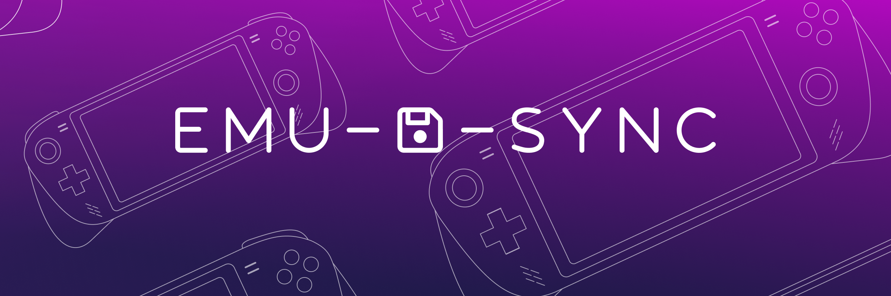
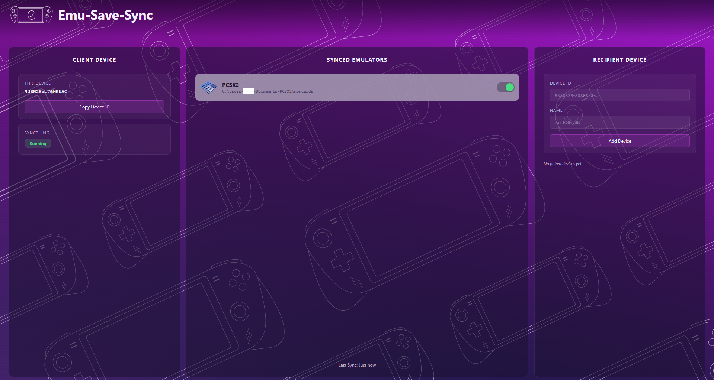

<p align="center">
  
</p>

<h1 align="center">Emu-Save-Sync</h1>

<p align="center">
  Cross-platform emulator save file sync — powered by Syncthing.
</p>

<p align="center">
  <a href="https://github.com/thelaughingz101-stack/emu-save-sync/releases/latest">
    
  </a>
  
  
</p>

---

Emu-Save-Sync is a desktop app that automatically syncs your emulator save files across devices. It wraps [Syncthing](https://syncthing.net) — a proven peer-to-peer sync engine — so your saves move directly between your machines without touching any cloud server. Toggle sync on or off per emulator, pair a recipient device with a single ID, and let it run in the background while you play.



---

## Prerequisites

**Syncthing must be installed and running before you open Emu-Save-Sync.**

1. Download and install Syncthing from https://syncthing.net/downloads/
2. Launch Syncthing — it will open a web UI at `http://localhost:8384` in your browser
3. Leave Syncthing running in the background
4. Open Emu-Save-Sync

On Windows, Syncthing can be set to start automatically with Windows from its system tray icon — right-click the tray icon → **Start on Login**. That way you never have to launch it manually. If you forget, Emu-Save-Sync will show a banner with a Launch button.

---

## Supported Emulators

| Emulator | Save Sync | Status |
|----------|-----------|--------|
| PCSX2 | Memory Cards | v0.1.0 |
| RPCS3 | Saves + Memory Cards | v0.2.0 |

---

## Install

### Windows

1. Download `emu-save-sync-1.0.0-setup.exe` from the [latest release](https://github.com/thelaughingz101-stack/emu-save-sync/releases/latest)
2. Run the installer
3. Launch **Emu-Save-Sync** from the desktop shortcut or Start menu

### Linux

1. Download `emu-save-sync-1.0.0.AppImage` from the [latest release](https://github.com/thelaughingz101-stack/emu-save-sync/releases/latest)
2. Make it executable and run it:

```bash
chmod +x emu-save-sync-1.0.0.AppImage
./emu-save-sync-1.0.0.AppImage
```

---

## How It Works

Emu-Save-Sync talks to a locally running Syncthing instance through its REST API. When you toggle sync on for an emulator, the app registers that emulator's save folder with Syncthing and shares it with any paired devices. Syncthing handles the actual file transfer directly between your machines over your local network or the internet — no intermediary server involved. Sync pauses automatically while the emulator is running to prevent conflicts.

---

## Credits

See [CREDITS.md](CREDITS.md) for third-party attributions.

---

## Legal

Emu-Save-Sync is an independent utility for syncing emulator save files across devices. Emu-Save-Sync is not affiliated with, endorsed by, or sponsored by the PCSX2 Project, Sony Group Corporation, Sony Computer Entertainment Inc., or any platform holder or game publisher. All product names, logos, and brands referenced are property of their respective owners.

Emu-Save-Sync assumes you legally own the games and BIOS dumps you use with your emulators. This tool only syncs save files between your own devices.
